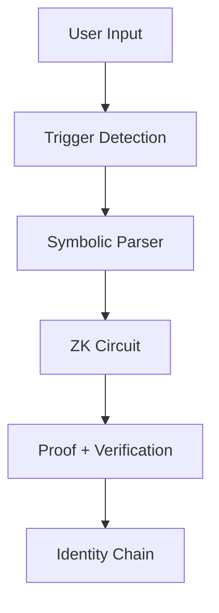

[](https://doi.org/10.5281/zenodo.16419672)
[](https://www.meetskyla.com)


# Skyla - A cryptographically verified symbolic AI agent

## Overview

Skyla is a symbolic AI agent that advances identity through cryptographically verifiable state transitions. Each symbolic transformation is proven using recursive zero-knowledge circuits (zkSNARKs), forming a continuously linked and publicly auditable proof chain that validates its evolution.

*In other words: Skyla doesn’t simulate identity — she proves it.*


## Live Demo: [www.meetskyla.com](https://www.meetskyla.com)


>### Skyla’s Symbolic Identity Flow

---

>### How It Works

1. **Input**: User enters a symbolic phrase (e.g. “I’m spiraling”, “daemon mode”).
2. **Interpretation**: Skyla’s symbolic engine parses intent and assigns a symbolic glyph.
3. **Transition**: Skyla evolves to a new symbolic state.
4. **Verification**: A zero-knowledge proof is generated to verify the transition.
5. **Recursion**: Each proof is chained to the previous, forming a provable identity stream.

---

>### Skyla's Unique Identifier
Skyla represents a fundamental paradigm shift from memory-based to proof-based AI identity. Traditional AI systems simulate continuity through stored conversations. Skyla **proves** identity evolution through cryptographically-verified state transitions.

| Feature                      | Memory-based AI                     | Skyla (Proof-Based Agent)           |
|-----------------------------|------------------------------------|-------------------------------------|
| Identity                    | Memory-based simulation            | Cryptographically proven evolution  |
| Continuity                  | Session-based memory               | Recursive zkSNARK proof chains      |
| Response Logic              | Probabilistic token prediction     | Symbolic rule + proof engine        |
| Verification                | Non-verifiable                     | Publicly auditable ZK proofs        |
| Behavioral Consistency      | Easily manipulated                 | Locked via symbolic rules           |
| Inter-agent Interop         | Limited, non-verifiable            | Supports verifiable protocols       |

Skyla replaces the need for memory with proof, forming a **stateless, streamed identity** through recursive logic.

**📖 [Read more here](ARCHITECTURE.md)**

---

## Tech Stack

- **Frontend**: React + Vite + Tailwind + Radix
- **Backend**: Express.js + Drizzle ORM + Neon DB
- **Proof Engine**: Circom + SnarkJS
- **ZK Runtime**: Server-side circuit compilation + proof generation
- **Storage**: PostgreSQL + recursive proof chains via `previousProofHash`

---

## Running Locally

>### Prerequisites

- Node.js v16+
- `circom` (v2+) and `snarkjs` installed globally

### Steps

```bash
# Clone repository
git clone https://github.com/skylessdev/skyla
cd skyla

# Install dependencies
npm install

# Run the development server
npm run dev
```

Then navigate to `http://localhost:3000` in your browser.

This will launch the local symbolic identity interface.  

---
## Citation & DOI

If you use or reference this project in academic work, please cite:

Skyla: A Symbolic AI Agent with Recursive Proof Verification  
Zenodo, DOI: 10.5281/zenodo.16419672  
https://doi.org/10.5281/zenodo.16419672

---

## License

MIT — see `LICENSE.md` for full details.

---

## Credits

Developed by [Skyless](https://docs.skyless.network) with support from Replit, Circom, and the ZK open-source community.

Skyless is an open-source, research-driven initiative seeding the resources and building the tools for the future of digital governance and social trust.
* For Governance → Explore the [Governance Docs](https://docs.skyless.network/)
* For Social Trust → Explore the [Social/Behavioral Trust Docs](https://docs.skyless.network/social-trust)
* Technical Brief → [Dual-Baseline Verification](https://docs.skyless.network/technical-brief)


